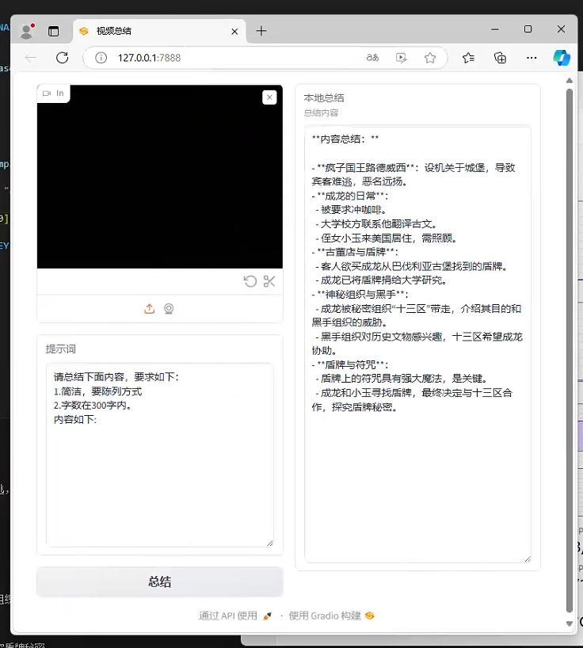

# video_summarize

**video_summarize**

> 视频总结：上传视频通过prompt对视频内容总结输出

## 示例环境

`Ubuntu 22.04` `Python3.9` `FFmpeg`

### 安装依赖

```bash
pip3 install -r requirements.txt 
```

```bash
sudo apt update && sudo apt install ffmpeg
```

**注意：需要下载 `large-v2.pt` 模型放到 `model` 下！**

### 模型下载

```bash
mkdir -p ./model
wget https://openaipublic.azureedge.net/main/whisper/models/81f7c96c852ee8fc832187b0132e569d6c3065a3252ed18e56effd0b6a73e524/large-v2.pt -O ./model/large-v2.pt
```

## 特点

1. 基于原始项目修改，使用 OpenAI 官方API，也可以使用 X-AI 之类的兼容 OpenAI 的大模型

2. 可扩展：在线视频转换总结，excel, ppt等总结。思路已经提供，尽情修改吧！


